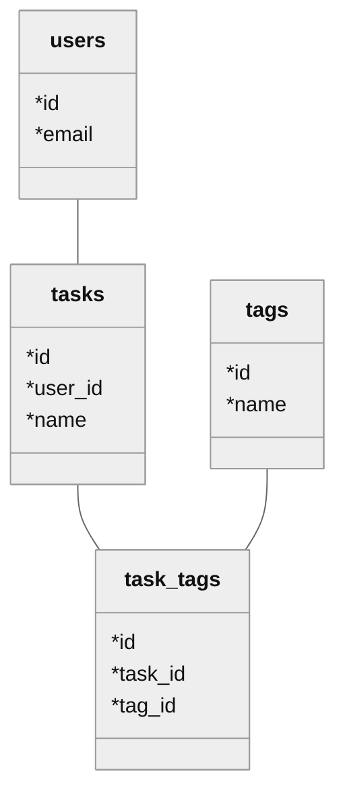

```mermaid
%%{init:{'theme':'neutral'}}%%

classDiagram
  users -- tasks
  tasks -- task_tags
  tags -- task_tags

  class users {
    *id
    *email
  }

  class tasks {
    *id
    *user_id
    *name
  }

  class tags {
    *id
    *name
  }

  class task_tags {
    *id
    *task_id
    *tag_id
  }
```
