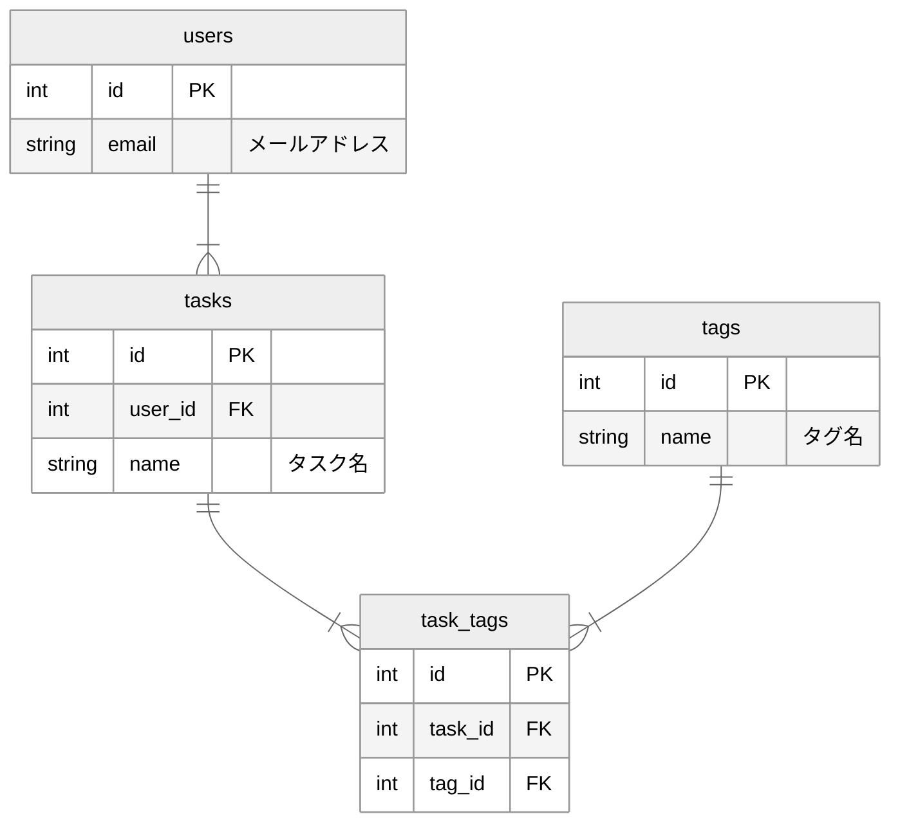

```mermaid
%%{init:{'theme':'neutral'}}%%

erDiagram
  users ||--|{ tasks : ""
  tasks ||--|{ task_tags : ""
  tags ||--|{ task_tags : ""

  users {
    int id PK
    string email "メールアドレス"
  }

  tasks {
    int id PK
    int user_id FK
    string name "タスク名"
  }

  tags {
    int id PK
    string name "タグ名"
  }

  task_tags {
    int id PK
    int task_id FK
    int tag_id FK
  }
```
