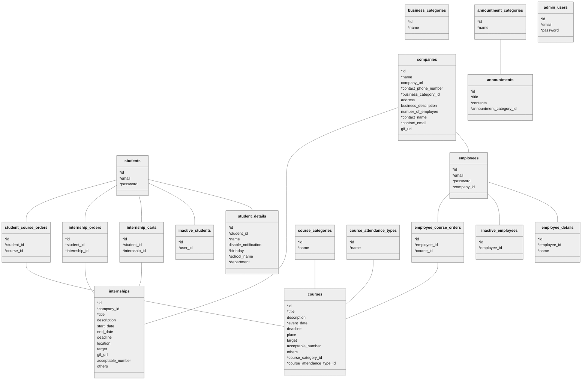

```mermaid
%%{init:{'theme':'neutral'}}%%

classDiagram
  students -- student_details
  students -- inactive_students
  employees -- employee_details
  employees -- inactive_employees

  business_categories -- companies
  companies -- employees
  companies -- internships

  students -- internship_carts
  students -- internship_orders
  internship_carts -- internships
  internship_orders -- internships

  course_categories -- courses
  course_attendance_types -- courses
  students -- student_course_orders
  student_course_orders -- courses
  employees -- employee_course_orders
  employee_course_orders -- courses

  annountment_categories -- annountments

  class admin_users {
    *id
    *email
    *password
  }

  class students {
    *id
    *email
    *password
  }

  class inactive_students {
    *id
    *user_id
  }

  class student_details {
    *id
    *student_id
    *name
    disable_notification
    *birthday
    *school_name
    *department
  }

  class employees {
    *id
    *email
    *password
    *company_id
  }

  class employee_details {
    *id
    *employee_id
    *name
  }

  class inactive_employees {
    *id
    *employee_id
  }

  class companies {
    *id
    *name
    company_url
    *contact_phone_number
    *business_category_id
    address
    business_description
    number_of_employee
    *contact_name
    *contact_email
    gif_url
  }

  class business_categories {
    *id
    *name
  }

  class internships {
    *id
    *company_id
    *title
    description
    start_date
    end_date
    deadline
    location
    target
    gif_url
    acceptable_number
    others
  }

  class internship_carts {
    *id
    *student_id
    *internship_id
  }

  class internship_orders {
    *id
    *student_id
    *internship_id
  }

  class course_categories {
    *id
    *name
  }

  class course_attendance_types {
    *id
    *name
  }

  class courses {
    *id
    *title
    description
    *event_date
    deadline
    place
    target
    acceptable_number
    others
    *course_category_id
    *course_attendance_type_id
  }

  class student_course_orders {
    *id
    *student_id
    *course_id
  }

  class employee_course_orders {
    *id
    *employee_id
    *course_id
  }

  class annountment_categories {
    *id
    *name
  }

  class annountments {
    *id
    *title
    *contents
    *annountment_category_id
  }
```
